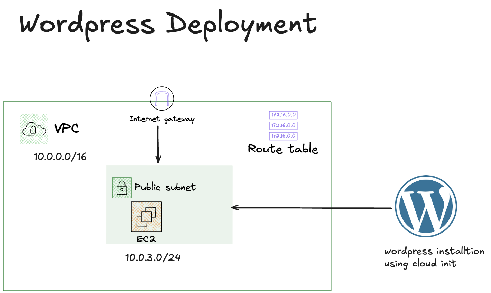

# CoderCo Terraform Infrastructure

This is a project where we deploy a WordPress website on AWS using Terraform. we will use an EC2 instance and set up a VPC for proper network isolation. we will start with getting everything from the terraform docs , then we will make it better by using modules and variables. The secret arguments will be stored in a terraform.tfvars file.

## System Design



## Prerequisites

- [Terraform](https://www.terraform.io/downloads.html) (version 1.0+)
- [AWS CLI](https://aws.amazon.com/cli/) configured with appropriate credentials
- AWS account with necessary permissions

## AWS Provider

This project uses AWS provider version `~> 6.0` and is configured for the `us-east-1` region.

## Usage

### Initialize Terraform

```bash
terraform init
```

### Plan Infrastructure

```bash
terraform plan
```

### Apply Infrastructure

```bash
terraform apply
```

### Destroy Infrastructure

```bash
terraform destroy
```

## Project Structure

```

├── Images/             # Project images and diagrams
├── modules/            # Terraform modules
│   ├── network/        # Network resources (VPC, subnets, security groups)
│   │   ├── main.tf
│   │   ├── variables.tf
│   │   └── outputs.tf
│   └── compute/        # Compute resources (EC2 instances)
│       ├── main.tf
│       ├── variables.tf
│       └── outputs.tf
├── user_data/          # Cloud-init configuration files
│   └── cloud_init.yaml # WordPress installation script
└── .DS_Store           # Git ignored: macOS file metadata
```

## Configuration Details

The project is organized in a modular way using Terraform modules:

- **network module**: Handles VPC, subnet, internet gateway, and security groups
- **compute module**: Handles EC2 instance creation and configuration
- **Main configuration**: Root files that tie modules together with variables

## Notes

- The security group currently allows SSH access from the configured CIDR block
- The EC2 instance uses a cloud-init configuration file for initial WordPress setup
- The project follows Infrastructure as Code (IaC) best practices with modular design
- SSH key name is configurable through variables
- AMI ID is set for Amazon Linux 2023

## Security Considerations

- Ensure AWS credentials are properly secured and not committed to version control
- Review security group rules before applying to production environments
- Consider enabling VPC flow logs for network monitoring
- Review and restrict IAM permissions as needed
- Update default passwords in cloud_init.yaml for production use
- Limit SSH access CIDR to trusted networks only

## License

This project is part of CoderCo infrastructure assignments.
